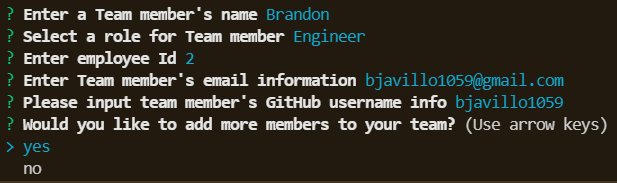

# Team Profile Generator

## Desription
Team Profile Generator is a Node.js command-line application that takes in information about employees on a basic software development team and generates an HTML page that displays summaries for each member. Before you can run this application the User must perform a npm install, so that the User is able to require all of the applications required dependencies.

Because this application won’t be deployed, you’ll need to provide a link to a walkthrough video that demonstrates its functionality and all of the tests passing. You’ll need to submit a link to the video AND add it to the readme of your project.

## Instructional
A screenshot for every individual team member questioning is posted below:
    -   
    

## Technology Used

    - HTML
    - JavaScript
    - Bootstrap
    - Node.js
    - Inquirer npm
    - Jest npm

## Contact Info
please contact me at [brandonjavillo@gmail.com](brandonjavillo@gmail.com)

## Process of Operations
As a User you will first need to open your intergrated terminal for the this application, make sure if you are using git bash that you are in the correct file of Main.js. 
Once the intergrated terminal is up and the User is in the correct file, the User will need to npm install to get the requried dependencies for the application.
When the npm install is complete, the User will test the application for functionality with individual tests
    - Employee
    - Engineer
    - Intern
    - Manager.
Four total test suites with 15 total test will run when the User runs 'npm run test' function.
When the test are complete, the User can initiate the application by inputting node Main.js in the intergrated terminal.
 